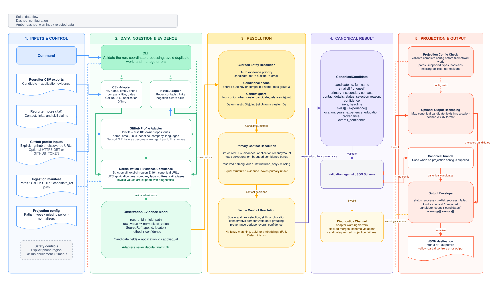

# Multi-Source Candidate Data Transformer

A Python CLI that merges recruiter CSV and recruiter-note data into validated candidate profiles. It supports canonical output and runtime-configured output projection.

## System design



## Setup

Requires Python 3.10 or newer.

```bash
python3 -m venv .venv
source .venv/bin/activate
python -m pip install --upgrade pip
python -m pip install -r requirements.txt
```

## Run

From the repository root, generate the default canonical output:

```bash
python -m candidate_transformer \
  --manifest sample_dataset/01_repeated/manifest.json \
  --output out/default.json
```

Generate custom-config output:

```bash
python -m candidate_transformer \
  --manifest sample_dataset/01_repeated/manifest.json \
  --config sample_dataset/01_repeated/config.json \
  --output out/candidates.json
```

The generated examples are committed at:

- [`out/default.json`](out/default.json)
- [`out/candidates.json`](out/candidates.json)

## Strict mode versus `--allow-partial`

Strict mode is the default. If any pipeline error occurs, the CLI prints the error to stderr, exits with status `1`, and does not write the output file. Warnings do not stop output.

Use `--allow-partial` when valid candidates should still be written even if other inputs or candidates fail:

```bash
python -m candidate_transformer \
  --manifest sample_dataset/08_diagnostics/manifest.json \
  --config sample_dataset/08_diagnostics/config.json \
  --output out/partial.json \
  --allow-partial
```

| Result | Output status | Exit status | Output written? |
| --- | --- | ---: | --- |
| No errors | `success` | `0` | Yes |
| Errors, with at least one valid candidate and `--allow-partial` | `partial_success` | `0` | Yes, including `errors` and valid candidates |
| Errors, with no valid candidates and `--allow-partial` | `failed` | `1` | Yes, including `errors` |
| Any pipeline error in strict mode | — | `1` | No |

Configuration or manifest files that cannot be read or parsed fail immediately with exit status `1`, even when `--allow-partial` is supplied.

## Test

```bash
python -m pytest -q
```

Run all nine end-to-end golden cases:

```bash
./run_demo_cases.sh
```

## Other inputs

Inputs can also be passed directly without a manifest:

```bash
python -m candidate_transformer \
  --csv path/to/applications.csv \
  --note path/to/notes.txt \
  --config config/projection.json
```

Use `python -m candidate_transformer --help` for all options. GitHub enrichment is optional; enable it with `--enrich-github` and optionally set `GITHUB_TOKEN`.

## Assumptions and scope

- Recruiter CSV is assumed to be exported by a system such as Eightfold or Workday, so it receives higher priority than unstructured sources.
- Candidate reference IDs belong to one global namespace. A shared candidate reference ID is strong identity evidence; conflicting candidate reference IDs prevent an otherwise possible merge.
- Email and GitHub URL are automatic identity keys. Phone numbers merge records only when corroborated by another strong key or a compatible name in a small phone-sharing group. Names alone never trigger a merge.
- Only a contact value observed in recruiter CSV data can become the primary email or phone. Notes and GitHub data can corroborate it or remain as secondary evidence.
- Local phone numbers require an explicit `--default-phone-region`; otherwise they are rejected with a warning. Accepted phone numbers are emitted in E.164 format.
- `candidate_id` is a deterministic cluster hash generated by this application. External ATS candidate IDs are used for matching and conflict checks but are not exposed as the canonical ID.
- GitHub enrichment is optional and network-dependent. A supplied GitHub URL is retained if enrichment fails; API failures become warnings. Language evidence is limited to the first 100 owner repositories and excludes forks.
- The current implementation deliberately excludes fuzzy, LLM, embedding, and name-only matching; resume/OCR parsing; ATS JSON and LinkedIn adapters; database persistence; and a manual-review UI.
- Location, education, years of experience, and experience summaries remain in the canonical schema but are not populated by the current adapters.
